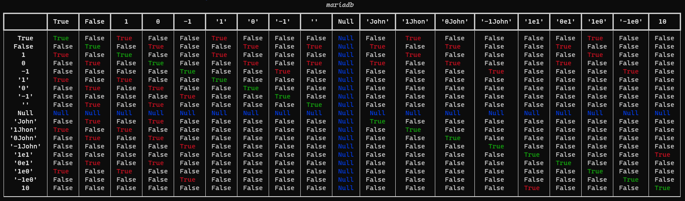
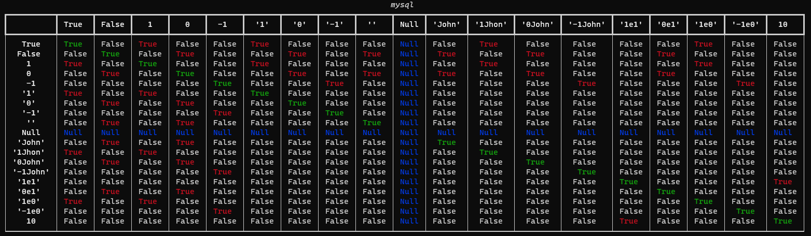
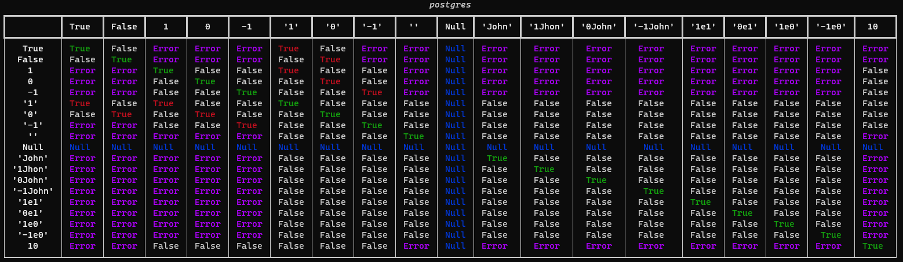
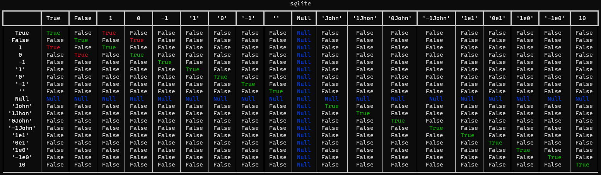

# SQL loose comparison

<p align="center">
  A complete table of results of types comparison in mariadb, mysql, postgres, sqlite.
  <br>
  <br>
</p>

## Results

### mariadb



### mysql



### postgres



### sqlite



## Script usage 

To use this script:

```bash
python3 -m pip install -r requirements.txt
docker-compose up -d
python3 loose_compare.py
```

## Contributing

Pull requests are welcome. Feel free to open an issue if you want to add other features.
